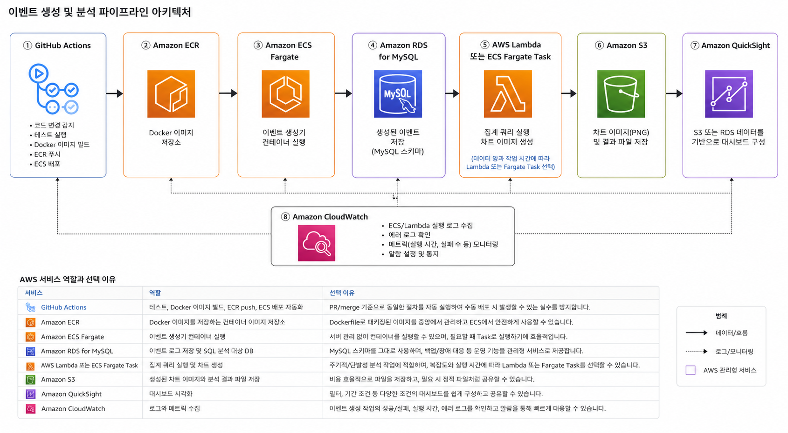
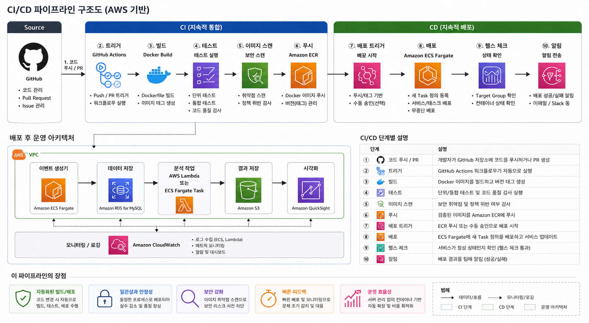

# Event Log Pipeline

웹 서비스에서 발생하는 사용자 행동 이벤트를 생성하고, MySQL에 저장한 뒤 SQL로 집계하고 차트 이미지로 시각화하는 데이터 파이프라인입니다.

## 프로젝트 구성

```text
app/
  generate_events.py      # 랜덤 이벤트 생성 및 테스트용 JSONL 샘플 생성
  main.py                 # 이벤트 생성 후 MySQL 저장 실행
  store_events.py         # 이벤트 데이터를 MySQL 컬럼에 매핑하여 저장
  analyze_events.py       # SQL 집계 결과 콘솔 출력
  visualize_events.py     # SQL 집계 결과 차트 이미지 생성
  db.py                   # MySQL 연결 설정
sql/
  init.sql                # events 테이블 생성
  analysis.sql            # 분석 쿼리 모음
k8s/
  job.yaml
  configmap.yaml
  secret.yaml
aws_architecture/
  aws_architecture.png
  cicd_pipeline.png
```

## 실행 방법

### 필요한 도구

- Docker
- Docker Compose

### 설치

별도 Python 환경을 직접 구성하지 않아도 됩니다. Docker Compose가 MySQL과 Python 앱을 함께 실행합니다.

```bash
git clone <repository-url>
cd <repository-name>
```

### 실행

```bash
docker compose up --build
```

실행하면 아래 순서로 자동 동작합니다.

1. MySQL 컨테이너 실행
2. `sql/init.sql`로 `events` 테이블 생성
3. Python 앱에서 랜덤 이벤트 1,000건 생성
4. 생성된 이벤트를 MySQL에 필드별 저장
5. SQL 집계 결과 기반 차트 이미지 생성

저장된 데이터의 집계 결과를 콘솔에서 확인하려면 다른 터미널에서 실행합니다.

```bash
docker compose run --rm app python analyze_events.py
```

데이터를 초기화하고 다시 실행하려면 볼륨까지 삭제합니다.

```bash
docker compose down -v
docker compose up --build
```

### 테스트용 이벤트 샘플 생성

DB 없이 이벤트 구조만 확인하고 싶을 때 JSONL 샘플을 생성할 수 있습니다. 실제 파이프라인은 JSONL 파일을 거치지 않고 생성한 이벤트를 바로 MySQL에 저장합니다.

```bash
python3 app/generate_events.py --count 10 --output output/events.jsonl
```

## 이벤트 설계

| 이벤트 타입 | 설명 |
| --- | --- |
| `page_view` | 사용자가 페이지를 조회한 이벤트 |
| `click` | 사용자가 버튼 또는 영역을 클릭한 이벤트 |
| `purchase` | 사용자가 상품을 구매한 이벤트 |
| `error` | 서비스 사용 중 에러가 발생한 이벤트 |

공통 필드는 `event_id`, `user_id`, `event_type`, `page`, `created_at`입니다. `purchase`는 `product_id`, `amount`를 추가로 사용하고, `error`는 `error_code`를 사용합니다.

이벤트 타입은 사용량, 전환, 장애 흐름을 함께 볼 수 있도록 설계했습니다. `page_view`와 `click`은 일반 행동 분석에, `purchase`는 매출/전환 분석에, `error`는 서비스 품질 확인에 사용합니다.

## 스키마 설명

저장소는 MySQL을 선택했습니다. 이벤트를 JSON 전체로 저장하지 않고 컬럼으로 분리하면 이벤트 타입, 사용자, 시간 기준 집계를 SQL로 바로 수행할 수 있습니다. Docker Compose에서 앱과 DB를 함께 실행하기도 쉽고, 현재 과제 규모에서는 MySQL 하나로 저장과 분석을 충분히 처리할 수 있다고 판단했습니다.

```sql
CREATE TABLE IF NOT EXISTS events (
    event_id CHAR(36) PRIMARY KEY,
    user_id INT NOT NULL,
    event_type VARCHAR(50) NOT NULL,
    page VARCHAR(100),
    product_id INT,
    amount DECIMAL(10, 2),
    error_code VARCHAR(50),
    created_at DATETIME NOT NULL,
    INDEX idx_events_event_type (event_type),
    INDEX idx_events_user_id (user_id),
    INDEX idx_events_created_at (created_at)
);
```

하나의 `events` 테이블에 공통 필드와 이벤트별 선택 필드를 함께 두었습니다. 이벤트 타입마다 테이블을 나누면 구조는 더 엄격해질 수 있지만, 작은 로그 파이프라인에서는 전체 이벤트 흐름을 한 테이블에서 집계하는 편이 단순하고 분석하기 쉽다고 판단했습니다.

## 데이터 집계 분석

분석 쿼리는 [sql/analysis.sql](./sql/analysis.sql)에 정리했습니다.

| 분석 | 목적 |
| --- | --- |
| 이벤트 타입별 발생 횟수 | 어떤 이벤트가 가장 많이 발생하는지 확인 |
| 유저별 총 이벤트 수 | 활동량이 많은 사용자를 확인 |
| 시간대별 이벤트 추이 | 이벤트가 많이 발생하는 시간대를 확인 |
| 에러 이벤트 비율 | 전체 이벤트 중 에러 비중 확인 |

예시 쿼리:

```sql
SELECT
    event_type,
    COUNT(*) AS event_count
FROM events
GROUP BY event_type
ORDER BY event_count DESC;
```

## 시각화 결과

시각화는 [app/visualize_events.py](./app/visualize_events.py)에서 수행합니다. MySQL에 저장된 데이터를 SQL 집계로 조회한 뒤 Matplotlib으로 PNG 파일을 생성합니다.

| 파일 | 내용 |
| --- | --- |
| `output/charts/event_type_counts.png` | 이벤트 타입별 발생 횟수 막대그래프 |
| `output/charts/hourly_trend.png` | `월-일 시` 형식으로 표시한 시간대별 이벤트 추이 라인그래프 |


## Docker 구성

| 서비스 | 역할 |
| --- | --- |
| `db` | MySQL 8.4 실행 및 `events` 테이블 생성 |
| `app` | 이벤트 생성, MySQL 저장, 차트 이미지 생성 |

`app` 서비스는 `db`의 healthcheck가 성공한 뒤 실행됩니다. MySQL은 Compose 내부 네트워크에서만 사용하므로 호스트의 3306 포트를 사용 중이어도 실행할 수 있습니다.

## 구현하면서 고민한 점

처음에는 이벤트를 JSONL 파일로 만든 뒤 DB에 저장하는 구조도 고려했습니다. 하지만 과제 요구사항이 이벤트 생성 후 저장까지 자동으로 동작하는 파이프라인이고, JSON을 통째로 저장하지 말라는 조건도 있어 최종 실행 흐름은 `이벤트 생성 → MySQL 직접 저장`으로 정리했습니다. JSONL 생성은 이벤트 구조를 눈으로 확인하는 테스트용 기능으로만 남겼습니다.

저장소는 파일보다 MySQL을 선택했습니다. CSV나 JSONL 파일은 구현이 단순하지만, 이벤트 타입별 집계, 사용자별 집계, 시간대별 추이 분석을 SQL로 표현하기에는 관계형 DB가 더 적합하다고 판단했습니다.

Docker Compose에서는 MySQL의 3306 포트를 호스트에 공개하지 않았습니다. 로컬에 이미 MySQL이 실행 중이면 포트 충돌이 발생할 수 있고, 이 과제에서는 `app` 컨테이너가 Compose 내부 네트워크로 `db`에 접속하면 충분하기 때문입니다.

시각화는 별도 BI 도구 대신 Matplotlib으로 PNG 파일을 생성했습니다. 평가자가 별도 계정이나 대시보드 설정 없이 `docker compose up --build`만으로 결과 이미지를 재현할 수 있게 하는 것이 더 중요하다고 봤습니다.

## 선택 과제 A: Kubernetes

Kubernetes manifest는 [k8s](./k8s)에 작성했습니다. 실제 클러스터 배포는 수행하지 않고, 이벤트 생성기 앱을 Kubernetes에서 실행한다고 가정한 설정 파일입니다.

| 파일 | 리소스 | 역할 |
| --- | --- | --- |
| `k8s/job.yaml` | Job | 이벤트 생성기 컨테이너를 실행하고, 지정한 개수의 이벤트를 생성한 뒤 MySQL에 저장합니다. |
| `k8s/configmap.yaml` | ConfigMap | DB host, port, database name, 이벤트 생성 수처럼 환경마다 바뀔 수 있는 일반 설정을 관리합니다. |
| `k8s/secret.yaml` | Secret | MySQL 사용자명과 비밀번호처럼 코드에 직접 남기기 부담스러운 값을 관리합니다. |

이벤트 생성기는 요청을 계속 받는 서버가 아니라 실행 후 종료되는 배치 작업에 가깝기 때문에 `Deployment`보다 `Job`을 선택했습니다. `ConfigMap`과 `Secret`은 설정값과 민감 정보를 분리하기 위해 선택했습니다.

## 선택 과제 B: AWS

이 파이프라인을 AWS에서 운영한다면 Docker Compose로 구성한 역할을 AWS 관리형 서비스로 나누어 설계할 수 있습니다.

### 전체 아키텍처



전체 파이프라인은 `GitHub Actions → Amazon ECR → Amazon ECS Fargate → Amazon RDS for MySQL → AWS Lambda 또는 ECS Fargate Task → Amazon S3 → Amazon QuickSight` 흐름으로 설계했습니다. CloudWatch는 각 실행 단계의 로그와 메트릭을 수집해 실패 여부와 에러 원인을 확인하는 역할로 둡니다.

### CI/CD 파이프라인



CI/CD는 GitHub Actions에서 테스트, Docker 이미지 빌드, 이미지 스캔, ECR push를 수행하고, 배포 단계에서 ECS Fargate의 Task 정의와 서비스를 갱신하는 흐름으로 설계했습니다.

예시 workflow는 [.github/workflows/aws-deploy.yml](./.github/workflows/aws-deploy.yml)에 작성했습니다. `main` 브랜치에 코드가 병합되면 Python 문법 검사를 실행하고, `DEPLOY_TO_AWS` repository variable이 `true`일 때 Docker 이미지를 빌드해 Amazon ECR에 push한 뒤 ECS Fargate 서비스의 Task Definition을 갱신합니다.

실제 AWS 계정에서 사용하려면 아래 값을 GitHub Actions Variables/Secrets로 등록해야 합니다.

| 이름 | 구분 | 설명 |
| --- | --- | --- |
| `DEPLOY_TO_AWS` | Variable | AWS 배포 job 실행 여부입니다. `true`로 설정하면 배포 job이 실행됩니다. |
| `AWS_ROLE_TO_ASSUME` | Secret | GitHub Actions가 AWS에 접근할 때 사용할 IAM Role ARN |
| `AWS_REGION` | Secret | 배포 리전 |
| `ECR_REPOSITORY` | Secret | Docker 이미지를 push할 ECR repository 이름 |
| `ECS_CLUSTER` | Secret | 배포 대상 ECS cluster 이름 |
| `ECS_SERVICE` | Secret | 배포 대상 ECS service 이름 |
| `ECS_TASK_DEFINITION` | Secret | 갱신할 ECS task definition 이름 또는 ARN |
| `ECS_CONTAINER_NAME` | Secret | task definition 안에서 이미지가 교체될 컨테이너 이름 |

### AWS 서비스 역할과 선택 이유

| 서비스 | 역할 | 선택 이유 |
| --- | --- | --- |
| GitHub Actions | 테스트, Docker 이미지 빌드, ECR push, ECS 배포 자동화 | PR/merge 기준으로 같은 배포 절차를 반복 실행하기 위해 사용합니다. |
| Amazon ECR | Docker 이미지 저장소 | Dockerfile로 패키징된 앱 이미지를 ECS에서 사용할 수 있게 관리합니다. |
| Amazon ECS Fargate | 이벤트 생성기 컨테이너 실행 | 서버 관리 없이 컨테이너를 작업 단위로 실행할 수 있습니다. |
| Amazon RDS for MySQL | 이벤트 로그 저장 및 SQL 분석 대상 DB | 현재 MySQL 스키마를 그대로 활용할 수 있고, 백업과 장애 대응 기능을 관리형으로 사용할 수 있습니다. |
| AWS Lambda 또는 ECS Fargate Task | 집계 쿼리 실행 및 차트 생성 | 분석 작업을 필요할 때 실행하기 좋습니다. 의존성이 많거나 실행 시간이 길면 Fargate Task가 더 적합합니다. |
| Amazon S3 | 차트 이미지와 분석 결과 파일 저장 | PNG 같은 결과 파일을 저렴하게 저장하고 공유할 수 있습니다. |
| Amazon QuickSight | 대시보드 시각화 | 기간 조건과 필터가 있는 운영 대시보드를 구성할 수 있습니다. |
| Amazon CloudWatch | 로그와 메트릭 수집 | 작업 실패 여부, 실행 시간, 에러 로그를 확인합니다. |

### 선택한 AWS 서비스의 역할 차이

GitHub Actions는 배포 자동화 계층이고, ECR은 빌드된 Docker 이미지를 보관하는 저장소입니다. ECS Fargate는 이미지를 실제로 실행하는 컴퓨팅 계층이며, RDS는 이벤트 데이터를 보관하는 데이터 저장 계층입니다.

S3는 차트 이미지나 결과 파일을 보관하는 객체 저장소이고, QuickSight는 저장된 데이터를 대시보드로 보여주는 시각화 계층입니다. CloudWatch는 파이프라인 실행 중 발생한 로그와 장애를 확인하는 운영 관찰 도구입니다.

### 설계하면서 가장 고민한 부분

가장 고민한 부분은 이벤트 생성과 분석 작업을 항상 실행되는 서버로 둘지, 필요할 때 실행되는 작업으로 둘지였습니다. 이 과제의 이벤트 생성기는 정해진 개수의 이벤트를 만들고 종료되는 배치성 프로그램이므로 EC2 상시 서버보다 ECS Fargate Task나 Lambda처럼 작업 단위로 실행하는 구성이 더 적합하다고 판단했습니다.

또한 이벤트 데이터와 시각화 결과의 저장 위치를 분리했습니다. RDS는 원천 이벤트와 SQL 집계에 적합하지만 PNG 파일 같은 산출물은 S3에 저장하는 편이 자연스럽습니다. 배포 측면에서는 이미지 버전 관리와 반복 가능한 배포가 중요하다고 보고 GitHub Actions와 ECR을 포함했습니다.
