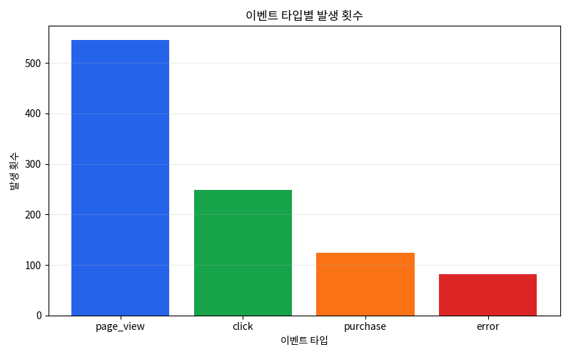
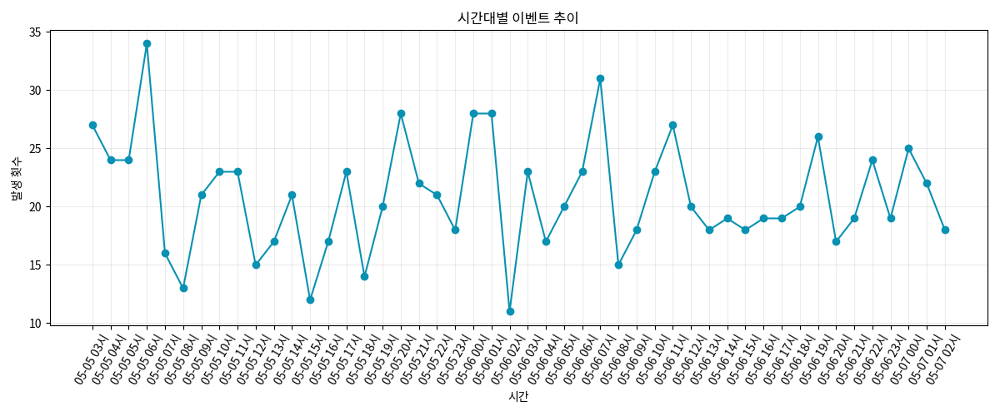

# Event Log Pipeline

웹 서비스의 사용자 행동 이벤트를 생성하고, 저장, 분석, 시각화까지 확장하는 데이터 파이프라인 과제입니다.

## 현재 브랜치 범위

`part-6-kubernetes` 브랜치는 선택 과제 A Kubernetes manifest와 설명을 추가합니다.

## 실행 방법

Docker Compose로 MySQL과 Python 앱을 함께 실행합니다.

```bash
docker compose up --build
```

실행하면 MySQL 컨테이너가 먼저 준비되고, Python 앱이 이벤트 1,000건을 생성한 뒤 MySQL `events` 테이블에 저장합니다. 이후 집계 결과를 차트 이미지로 저장합니다.

저장된 데이터를 확인하려면 다른 터미널에서 아래 명령어를 실행합니다.

```bash
docker compose run --rm app python analyze_events.py
```

생성된 차트 이미지는 아래 경로에 저장됩니다.

```text
output/charts/event_type_counts.png
output/charts/hourly_trend.png
```

데이터를 초기화하고 처음부터 다시 실행하려면 볼륨까지 삭제합니다.

```bash
docker compose down -v
docker compose up --build
```

로컬 MySQL을 직접 사용하는 경우에는 접속 정보를 환경 변수로 설정한 뒤 수동 실행할 수 있습니다.

```bash
export MYSQL_HOST=127.0.0.1
export MYSQL_PORT=3306
export MYSQL_USER=events_user
export MYSQL_PASSWORD=events_password
export MYSQL_DATABASE=events_db

mysql -h "$MYSQL_HOST" -P "$MYSQL_PORT" -u "$MYSQL_USER" -p"$MYSQL_PASSWORD" "$MYSQL_DATABASE" < sql/init.sql
python3 app/main.py --count 1000
python3 app/analyze_events.py
```

`app/main.py`는 이벤트를 메모리에서 생성한 뒤 바로 MySQL에 저장합니다.

JSONL 파일 생성은 테스트와 샘플 확인용입니다. DB 없이 이벤트 구조를 눈으로 확인하고 싶을 때만 아래 명령어를 사용합니다.

```bash
python3 app/generate_events.py --count 10 --output output/events.jsonl
```

## 이벤트 설계

| 이벤트 타입 | 설명 |
| --- | --- |
| `page_view` | 사용자가 페이지를 조회한 이벤트 |
| `click` | 사용자가 버튼 또는 영역을 클릭한 이벤트 |
| `purchase` | 사용자가 상품을 구매한 이벤트 |
| `error` | 서비스 사용 중 에러가 발생한 이벤트 |

공통 필드는 `event_id`, `user_id`, `event_type`, `page`, `created_at`으로 구성했습니다. `purchase`는 `product_id`, `amount`를 추가로 사용하고, `error`는 `error_code`를 사용합니다.

이벤트 타입은 웹 서비스에서 기본적으로 확인하는 사용량, 전환, 장애 흐름을 함께 볼 수 있도록 골랐습니다.

## 스키마 설명

저장소는 MySQL을 선택했습니다. 작은 이벤트 로그를 테이블 형태로 저장하고 SQL 집계를 수행하기에 충분하며, Docker Compose에서 앱과 함께 띄우기 쉽고 면접에서 설명하기도 명확합니다.

```sql
CREATE TABLE IF NOT EXISTS events (
    event_id CHAR(36) PRIMARY KEY,
    user_id INT NOT NULL,
    event_type VARCHAR(50) NOT NULL,
    page VARCHAR(100),
    product_id INT,
    amount DECIMAL(10, 2),
    error_code VARCHAR(50),
    created_at DATETIME NOT NULL
);
```

JSON을 통째로 저장하지 않고 이벤트의 주요 필드를 컬럼으로 분리했습니다. 이벤트 타입별 집계, 유저별 집계, 시간대별 집계를 빠르게 수행할 수 있도록 `event_type`, `user_id`, `created_at`에 인덱스를 둡니다.

## 데이터 집계 분석

분석 쿼리는 [sql/analysis.sql](./sql/analysis.sql)에 정리했습니다. `app/analyze_events.py`를 실행하면 MySQL에 저장된 `events` 테이블을 대상으로 같은 집계를 수행하고 결과를 콘솔에 출력합니다.

작성한 분석은 아래 4가지입니다.

| 분석 | 목적 |
| --- | --- |
| 이벤트 타입별 발생 횟수 | 사용자 행동이 어떤 이벤트에 집중되는지 확인 |
| 유저별 총 이벤트 수 | 활동량이 많은 사용자를 확인 |
| 시간대별 이벤트 추이 | 이벤트가 많이 발생하는 시간대를 확인 |
| 에러 이벤트 비율 | 전체 이벤트 중 서비스 에러가 차지하는 비중 확인 |

예시 쿼리:

```sql
SELECT
    event_type,
    COUNT(*) AS event_count
FROM events
GROUP BY event_type
ORDER BY event_count DESC;
```

## Docker 구성

| 서비스 | 역할 |
| --- | --- |
| `db` | MySQL 8.4를 실행하고 `sql/init.sql`로 `events` 테이블을 생성합니다. |
| `app` | Python 앱을 빌드한 뒤 이벤트 생성과 MySQL 저장을 실행합니다. |

`app` 서비스는 `db`의 healthcheck가 성공한 뒤 실행됩니다. 따라서 `docker compose up --build` 한 번으로 이벤트 생성부터 저장까지 자동으로 동작합니다.
MySQL은 Compose 내부 네트워크에서만 사용하므로 호스트의 3306 포트를 사용 중이어도 실행할 수 있습니다.

## 시각화 결과

시각화는 [app/visualize_events.py](./app/visualize_events.py)에서 수행합니다. MySQL에 저장된 데이터를 SQL 집계로 조회한 뒤, Matplotlib으로 PNG 파일을 생성합니다.

| 파일 | 내용 |
| --- | --- |
| `output/charts/event_type_counts.png` | 이벤트 타입별 발생 횟수 막대그래프 |
| `output/charts/hourly_trend.png` | `월-일 시` 형식으로 표시한 시간대별 이벤트 추이 라인그래프 |

Docker Compose 실행 후 생성된 이미지를 README에서 함께 확인할 수 있습니다.





## 선택 과제 A: Kubernetes

Kubernetes manifest는 [k8s](./k8s)에 작성했습니다. 실제 클러스터 배포는 수행하지 않고, 이벤트 생성기 앱을 Kubernetes에서 실행한다고 가정한 설정 파일입니다.

| 파일 | 리소스 | 역할 |
| --- | --- | --- |
| `k8s/job.yaml` | Job | 이벤트 생성기 컨테이너를 실행하고, 지정한 개수의 이벤트를 생성한 뒤 MySQL에 저장합니다. |
| `k8s/configmap.yaml` | ConfigMap | DB host, port, database name, 이벤트 생성 수처럼 환경마다 바뀔 수 있는 일반 설정을 관리합니다. |
| `k8s/secret.yaml` | Secret | MySQL 사용자명과 비밀번호처럼 코드에 직접 남기기 부담스러운 값을 관리합니다. |

이벤트 생성기는 요청을 계속 받는 서버가 아니라 실행 후 종료되는 배치 작업에 가깝기 때문에 `Deployment`보다 `Job`을 선택했습니다. `Job`은 실패 시 재시도 정책을 둘 수 있고, 이벤트 생성과 저장이 끝나면 Pod가 종료되어 작업 완료 여부를 확인하기 쉽습니다.

`ConfigMap`과 `Secret`은 설정값과 민감 정보를 분리하기 위해 선택했습니다. 이렇게 분리하면 이미지 재빌드 없이 DB 주소나 이벤트 생성 수를 바꿀 수 있고, 비밀번호를 일반 manifest나 코드에 직접 적는 범위를 줄일 수 있습니다.
